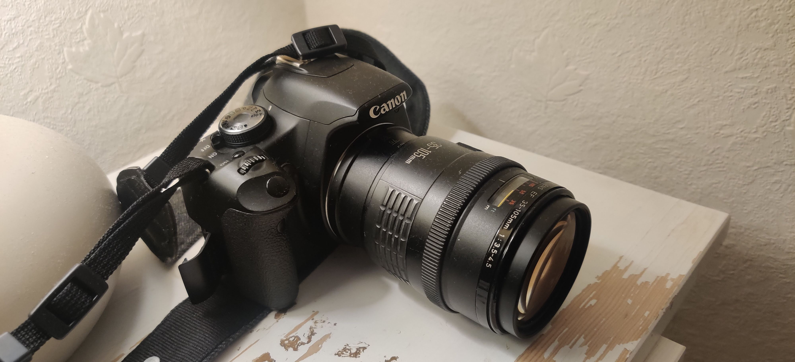

Last month I bought a 2012 Canon EOS 500d for £50.\
Last week I bought a 2014 HP 800 mini server for £90.\
I'm writing this post on a 2013 Macbook Air that I booted for the first time in 6 years yesterday.

Old stuff works. Until it doesn't.

### Camera

My father is an avid photographer which naturally meant I was completely uninterested in it until I hit my mid 30s when I finally relented and embraced my destiny. 

I bought a Canon 500d from eBay for £50, it arrived 3 days later replete with a AA battery charger (nb. this camera does not take AA batteries). I stole a couple of lenses from the aforementioned father (I don't think they're good, the AF doesn't work on one which makes me feel professional pulling focus whilst taking reliably blurred pictures), and I was off to the races. 

This isn't a great camera, but I am a worse photographer.  

### Server
I'm sick of Raspberry Pis as home servers. You can't buy rpi4s anywhere, even outside of a supply shortage they are surprisingly expensive when you add up the things you need to make them a sensible server. They are delicate, finicky and just powerful enough to be encouragingly useful, until you run into the inevitable  issues. One Docker container, fine. Four? Terrible. Every sentence finishes with a "but" when rpis are your home server.

So, after looking at the various alternatives, I bought a 2014 HP 800 g1 mini from Ebay for £82. It has 16gb of RAM, and a relatively low-end core i5 processor. It came with a 500gb HDD. 

Alongside that I bought an m.2 SATA drive, which, after disassembling the entire computer to access the m.2 slot, I discovered does _work_ but the motherboard did not come with the screw to seat the drive. Not I problem, I bravely thought, the fan casing will hold it in place. This turned out to be a mistake for some fairly obvious reasons. One slightly quicker, but no less fiddly dissassembly later, I decided to abandon the m.2 idea temporarily and use the HDD. I refuse to buy 500 m.2 screws to seat a single drive, but I have high hopes for the unopened packet of tiny screws I found in an Ikea kitchen shelf box.  

I have no idea if this is a good choice for a home server, I didn't obsessively research it because the stakes were low. Time will tell but the initial signs are good. It runs a bunch of useful containers (jellyfin, homeassistant, grafana, portainer, pi-hole etc), it's relatively quiet, it's considerably more performant and less annoying than rpis.   

### Laptop

Anyone that works in technology will have bits of kit lying around their house that they have no idea the origin of. For me, it's this 2013 MacBook Air. I assume at some point I either was given it professionally, socially or it was abandoned by an employer. 

I found it in a box whilst I was looking for an ethernet cable, and encouraged by my camera and my server experiences, plugged it in and was surprised to see a reassuring purple screen of life. It booted some comparatively ancient linux. The fact I entered the correct password first time should probably be a cause for concern. 

I was encouraged by the performance though and the fact the battery appeared to actually be charging. 30 minutes later I had a fresh Ubuntu installed, and, flashbacks of Broadcom b43xx drivers woes aside, this is an excellent machine. The battery lasts for a period of time, considerably less than my m1, considerably more than I would have thought. The keyboard feels like an old friend. 

## Thoughts

I'd stopped being a tinkerer when my job sucked the fun out of technology. Rediscovering the viability, quality and affordability of old stuff has brought some of that fun back. 

I value limitations, I thrive on limitations. Limitations breed creativity. Infinite possibilities mean you become obsessed with the means. Limitations force you to an end.  

Old stuff works, until it doesn't. But it hasn't stopped working yet, and when it does, it doesn't matter. You can just buy new old stuff. 

